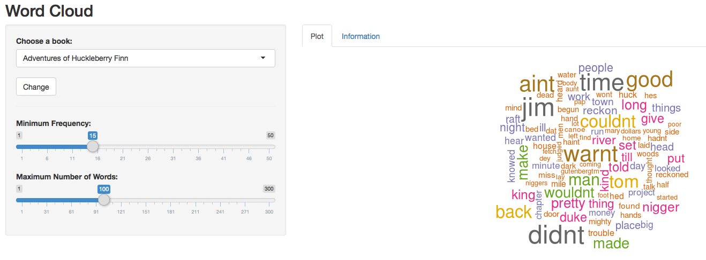

## Introduction

The pupose of this project is to provide a tool that will show the user
a wordcloud text analysis of two popular books by Mark Twain. This may
seem like a trival example, but can be powerful in industry. When you 
have a large amount of text data and you'd like to visulaize patterns
or areas of significance, this can be very useful. I use this technique
along with other tools from the "tm" package on a dialy basis in my 
analyis for my day job.
<br>
<br>
<br>
# **Word cloud:**
<br>
*An image composed of words use in a particular text or subject,* 
*in which the size of each word indicates the frequency or importance.* 

--- .class #id

## R Libraries Required

In order to perform the anaysis shown in this example you will need
to load the following libraries:
```{r eval=FALSE}
library(tm)
library(wordcloud)
library(memoise)
require(shiny)
require(httr)
require(markdown)
```
The **tm** package is the texual analysis package that we will use a few functions from. 
The **wordcloud** package will provide us functions for creating the actual wordcloud image. 
The **memoise** package is used for caching results to increase speed for looking at the analysis after it
has been fully processed once. This way the user/cusomter does not need to wait for processing each time 
they change an option on the application.
<br>
<br>
These are all packages easily obtainable for R both 3.1.x and 3.2.x and do not require a lot of overhead
to use and run.

---

## Methodology
First we will load the list of valid books. This can be extened to whatever texts you wish to analyze.
```{r eval=FALSE}
# The list of valid books.
books <<- list("Adventures of Huckleberry Finn" = "pg76.txt",
               "The Adventures of Tom Sawyer" = "pg74.txt")
```
The code the follows will be a fucntion that takes advantage of the **memoise** package. This allows us to cache resutls to allow
faster processing once the code is run initally. This function will create a Document Term Matrix that the **tm** package uses to
determine statistics on the text (word count, etc.).
```{r eval=FALSE}
getTermMatrix <- memoise(function(book) {

        # Our processing code will go here
        
}
```

---

## Methodology (cont'd)
Inside the function we will place the following code that will actually process the text and compute the statistics.
```{r eval=FALSE}
if (!(book %in% books))
                stop("Unknown New Paper")
        
        text <- readLines(sprintf("%s", book), encoding="UTF-8")
        myCorpus = Corpus(VectorSource(text))
        myCorpus = tm_map(myCorpus, content_transformer(tolower))
        myCorpus = tm_map(myCorpus, removePunctuation)
        myCorpus = tm_map(myCorpus, removeNumbers)
        myCorpus = tm_map(myCorpus, removeWords,
                c(stopwords("SMART"), "thy", "thou", "thee", "the", "and", "but"))
        myDTM = TermDocumentMatrix(myCorpus,
                control = list(minWordLength = 1))
        m = as.matrix(myDTM)
        sort(rowSums(m), decreasing = TRUE)
```

---

## Shiny
Now, we have this fancy code that computes some really cool statistics on our text, right? Now how
do we deliver it to our customer who might now have experience with R or may not be technical at all?
<br>
<br>
This is where Shiny comes in. We will use this package to create a web application that wraps an easy
to use interface over our code so the user can easily view and adjust the statistics. This reqires three
basic files in order to work:
<br>
- global.R (our processing code)
- server.R (the code that contains the instructions that your computer needs to build the application)
- ui.R (the code that will build the UI functions of the web application)
<br>
<br>
The **global.R** was covered in the previous slides. The shiny setup is fairly simple and will be left
as an exercise, however, the code for both the **server.R** and **ui.R** can be found at:
<br>
<br>
https://github.com/cabradbury/Developing-Data-Products-Project-1

---

## Shiny (cont'd)
The sceenshot below is the applciation loaded in your browser.
<br>
<br>

<br>
<br>
You can find the application here: 
<br>
https://cabradbury.shinyapps.io/Developing-Data-Products-Project-1

---

## Conclusion
If you need to provie insight or actionable information to your organization you can 
present it in a very usable format to your leadership through the use of the following 
tools:
<br>
<br>
- R: Peform your data science and analytics.
- Shiny: Provide your user interface to provide useful tools to manipulate the data.
- Slidify/Knitr/R Presentation: Provide documentation and presentation of your findings.
<br>
<br>

# Have fun!!!

